# eChat 🤖

   

**English** | [中文](./README_CN.md)

**eChat** is a cross-platform AI chat client built with **Kotlin Multiplatform (KMP)**. It serves as a unified interface for multiple LLM providers, allowing users to **Bring Your Own Keys (BYOK)** to chat with top-tier models like DeepSeek, Gemini, and OpenAI.

---

### ⚡️ Vibe Coding Showcase

> **This project is a 100% AI-Assisted creation.**
>
> * **Code & Logic:** Built using **Cursor**, **Antigravity**, **Codex**, and **Gemini CLI**.
> * **UI & Interaction:** Prototyped using [**Stitch**](https://stitch.withgoogle.com) and **Figma AI**.
>
> 🧠 **Curious about the process?**
> * [**View Development Prompts**](./docs/vibe_coding/prompt.md): See the exact prompts used to build the app logic.
> * [**View UI/UX Generation Prompts**](./docs/ui_ux/prompt.md): See how we generated the UI assets.


---

## ✨ Key Features & Roadmap

- [x] **Multi-Provider Support:** Configure API keys for DeepSeek, Gemini, and OpenAI.
- [x] **Cross-Platform:** Runs natively on Android & iOS via KMP.
- [x] **Privacy First:** API keys and chats stored locally (DataStore & Room).
- [x] **Chat History:** Persistent offline storage for conversations.
- [x] **Markdown Support:** Rich text rendering and code highlighting.
- [x] **Smart UX:** Error interception and "Empty State" guidance.
- [ ] **Streaming Response:** Real-time typing effect.
- [ ] **Desktop Support:** Native PC versions (Windows/macOS/Linux).
- [ ] **Voice Features:** TTS (Text-to-Speech) for AI responses.

---

## 🚀 Getting Started

### Android

To build and run the application on Android:
* Select the `composeApp` configuration in Android Studio.
* Or run via terminal:
    ```shell
    ./gradlew :composeApp:assembleDebug
    ```
  *(Windows: use `gradlew.bat`)*

### iOS

To build and run the application on iOS:
* Open **[`/iosApp`](./iosApp)** in Xcode.
* Or use the **Kotlin Multiplatform Mobile** plugin configuration in Android Studio.

---

## 🛠 Tech Stack & Architecture

This project is built using **Kotlin Multiplatform (KMP)** and **Compose Multiplatform (CMP)**.

**Why KMP?**
* **Native Performance:** Logic compiles directly to native binaries (JVM for Android, LLVM for iOS, Native for Desktop), ensuring zero runtime overhead.
* **Unified Development:** Shares **100% of business logic** (API Clients, ViewModel, DB) and **95%+ of UI** code.
* **Seamless Interop:** Full access to platform-specific APIs when needed.

### ⚖️ Cross-Platform Solution Comparison

Why we chose KMP over Flutter or React Native for eChat:

| Feature | **Kotlin Multiplatform (CMP)** | **Flutter** | **React Native** |
| :--- | :--- | :--- | :--- |
| **Performance** | **Native** (No Bridge/VM on iOS) | High (Dart VM + Custom Engine) | Good (JS Bridge overhead) |
| **UI Rendering** | **Skia (Canvas)** / Native Fallback | Skia / Impeller (Custom) | Native Components via JS |
| **Logic Sharing** | **100% Shared** (Networking, SQL) | Shared (Dart) | Shared (JS/TS) |
| **Ecosystem** | Reuse Android/Kotlin libraries | Dart-specific ecosystem | NPM / JavaScript ecosystem |

### 🏗️ Why MVI Architecture?

We adopted the **Model-View-Intent (MVI)** pattern combined with Unidirectional Data Flow (UDF) for this project.

* **Single Source of Truth:** The UI observes a single `UiState` object.
* **Predictability:** State changes only happen via specific `Intents`.
* **Thread Safety:** State mutations are serialized within the ViewModel.

#### 1. System Components (Structure)

```mermaid
graph TD
    %% --- Style Definitions ---
    classDef platform fill:#E3F2FD,stroke:#1565C0,stroke-width:2px,rx:10,ry:10;
    classDef ui fill:#FFF3E0,stroke:#EF6C00,stroke-width:2px,rx:10,ry:10;
    classDef presentation fill:#E8F5E9,stroke:#2E7D32,stroke-width:2px,rx:5,ry:5;
    classDef domain fill:#F3E5F5,stroke:#7B1FA2,stroke-width:2px,rx:5,ry:5;
    classDef data fill:#E0F7FA,stroke:#006064,stroke-width:2px,rx:5,ry:5;
    classDef remote fill:#FFEBEE,stroke:#C62828,stroke-width:2px,stroke-dasharray: 5 5;

    %% --- 1. Platform Layer ---
    subgraph Platforms ["📱 Platform Layer"]
        direction TB
        Android["🤖 Android Activity<br/>(MainActivity)"]:::platform
        iOS["🍎 iOS App<br/>(SwiftUI App / MainViewController)"]:::platform
    end

    %% --- 2. Shared Module ---
    subgraph CommonMain ["📦 Shared Module (commonMain)"]
        direction TB

        %% --- A. UI Layer ---
        subgraph UI_Layer ["🎨 CMP UI Layer"]
            AppEntry["App Composable Entry"]:::ui
            ChatScreen["ChatScreen"]:::ui
            UI_Components["Compose Components<br/>(MessageBubble, InputBar)"]:::ui
        end
        
        %% --- B. Presentation Layer ---
        subgraph Presentation ["🧠 Presentation Layer (MVI)"]
            ViewModel["ChatViewModel"]:::presentation
            State["ChatUiState<br/>(Immutable)"]:::presentation
            Intent["ChatIntent<br/>(Sealed Interface)"]:::presentation
        end

        %% --- C. Data / Domain Layer ---
        subgraph Data_Layer ["🏗️ Data Layer"]
            Repository["ChatRepository"]:::domain
            Model["Domain Models<br/>(ChatMessage, Session)"]:::domain
        end

        %% --- D. Data Sources ---
        subgraph Data_Sources ["💾 Data Sources"]
            subgraph Local ["Local Storage"]
                RoomDB["🗄️ Room Database<br/>(SQLite Bundled)"]:::data
                DataStore["⚙️ DataStore<br/>(Settings / API Key)"]:::data
            end
            
            subgraph Remote_Source ["Network"]
                Ktor["🌐 Ktor Client"]:::data
                LlmStrategy["LLM Strategy / Factory"]:::data
            end
        end
    end

    %% --- 3. External Services ---
    subgraph Cloud ["☁️ External LLM Providers"]
        DeepSeek["DeepSeek API"]:::remote
        Gemini["Google Gemini API"]:::remote
        OpenAI["OpenAI API"]:::remote
    end

    %% --- Connections ---
    
    %% Platform -> UI
    Android -->|SetContent| AppEntry
    iOS -->|ComposeUIViewController| AppEntry
    AppEntry --> ChatScreen
    ChatScreen --> UI_Components

    %% UI -> ViewModel (MVI Loop)
    ChatScreen -- "1. Dispatch Intent" --> Intent
    Intent --> ViewModel
    ViewModel -- "4. Emit New State" --> State
    State -- "5. Render UI" --> ChatScreen

    %% ViewModel -> Repository
    ViewModel -- "2. sendMessage()" --> Repository
    Repository -- "3. Flow&lt;Data&gt;" --> ViewModel
    Repository -.-> Model

    %% Repository -> Sources
    Repository -->|Read/Write| RoomDB
    Repository -->|Get API Key| DataStore
    Repository -->|Select Strategy| LlmStrategy
    LlmStrategy --> Ktor

    %% Network Flow
    Ktor --> DeepSeek
    Ktor --> Gemini
    Ktor --> OpenAI
    
    %% DI Injection
    Koin(("💉 Koin DI Container")) -.->|Injects| ViewModel
    Koin -.->|Injects| Repository
    Koin -.->|Injects| RoomDB
    Koin -.->|Injects| Ktor

    %% Link Styles
    linkStyle default stroke:#546E7A,stroke-width:2px;
```



#### 2. Message Data Flow (Sequence)

This sequence diagram illustrates the lifecycle of a chat message, from the user's input to the AI's streaming response, highlighting the optimistic UI updates and data persistence.


---

## 📂 Project Structure

* **[`/composeApp`](./composeApp/src)**: The core shared module.
    * `commonMain`: Shared UI, ViewModels, Database, and API client logic.
    * `androidMain`: Android specific implementation.
    * `iosMain`: iOS specific implementation.
    * `desktopMain`: Desktop (JVM) specific implementation.

* **[`/iosApp`](./iosApp/iosApp)**: The iOS entry point.
    * Contains the Xcode project and SwiftUI wrapper to host the Compose content.

---
*Built with ❤️ using [Kotlin Multiplatform](https://www.jetbrains.com/kotlin-multiplatform/).*