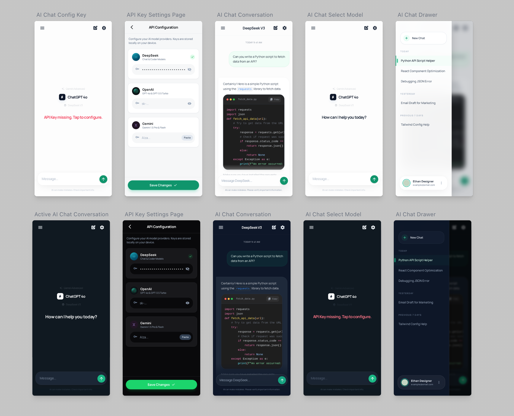
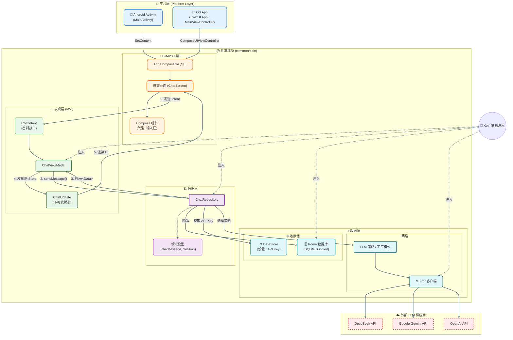
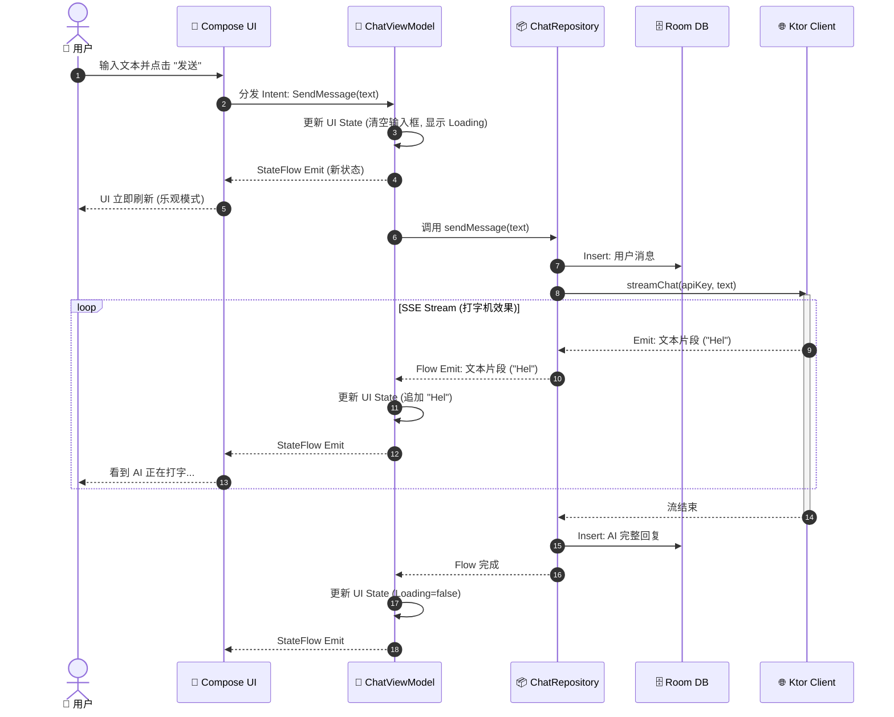

# eChat 🤖

   

[English](./README.md) | **中文**

**eChat** 是一个基于 **Kotlin Multiplatform (KMP)** 构建的跨平台 AI 聊天客户端。它作为一个统一的接口，支持多种 LLM（大语言模型）供应商，允许用户通过 **自带密钥 (BYOK)** 的方式与 DeepSeek、Gemini 和 OpenAI 等顶级模型进行对话。

---

### ⚡️ Vibe Coding 展示 (AI 编程)

> **本项目是一个 100% 由 AI 辅助创作的作品。**
>
> * **代码与逻辑:** 使用 **Cursor**, **Antigravity**, **Codex**, 和 **Gemini CLI** 构建。
> * **UI 与交互:** 使用 [**Stitch**](https://stitch.withgoogle.com) 和 **Figma AI** 进行原型设计。
>
> 🧠 **对开发过程感兴趣？**
> * [**查看开发提示词**](./docs/vibe_coding/prompt.md): 查看用于构建 App 逻辑的完整提示词记录。
> * [**查看 UI/UX 生成提示词**](./docs/ui_ux/prompt.md): 查看我们是如何生成 UI 资产的。



---

## ✨ 核心功能与路线图

- [x] **多模型支持:** 配置 DeepSeek, Gemini, 和 OpenAI 的 API 密钥。
- [x] **跨平台:** 通过 KMP 在 Android 和 iOS 上原生运行。
- [x] **隐私优先:** API 密钥和聊天记录完全本地存储 (DataStore & Room)。
- [x] **聊天记录:** 离线持久化存储对话历史。
- [x] **Markdown 支持:** 富文本渲染和代码块高亮。
- [x] **智能 UX:** 错误拦截和“空状态”引导。
- [ ] **流式响应 (Streaming):** 实时打字机效果。
- [ ] **桌面端支持:** 原生 PC 版本 (Windows/macOS/Linux)。
- [ ] **语音功能:** AI 回复的 TTS (文本转语音) 支持。

---

## 🚀 快速开始

### Android

在 Android 上构建并运行应用:
* 在 Android Studio 中选择 `composeApp` 配置。
* 或者通过终端运行:
    ```shell
    ./gradlew :composeApp:assembleDebug
    ```
  *(Windows 用户: 请使用 `gradlew.bat`)*

### iOS

在 iOS 上构建并运行应用:
* 在 Xcode 中打开 **[`/iosApp`](./iosApp)** 目录。
* 或者在 Android Studio 中使用 **Kotlin Multiplatform Mobile** 插件配置运行。

---

## 🛠 技术栈与架构

本项目使用 **Kotlin Multiplatform (KMP)** 和 **Compose Multiplatform (CMP)** 构建。

**为什么选择 KMP?**
* **原生性能:** 逻辑直接编译为原生二进制文件（Android 为 JVM，iOS 为 LLVM，桌面端为 Native），确保零运行时开销。
* **统一开发:** 共享 **100% 的业务逻辑** (API 客户端, ViewModel, 数据库) 和 **95%+ 的 UI** 代码。
* **无缝互操作:** 需要时可完全访问平台特定 API。

### ⚖️ 跨平台方案对比

为什么我们为 eChat 选择 KMP 而不是 Flutter 或 React Native:

| 特性 | **Kotlin Multiplatform (CMP)** | **Flutter** | **React Native** |
| :--- | :--- | :--- | :--- |
| **性能** | **原生** (iOS 无桥接/虚拟机) | 高 (Dart VM + 自定义引擎) | 良好 (JS 桥接开销) |
| **UI 渲染** | **Skia (Canvas)** / 原生回退 | Skia / Impeller (自定义) | 通过 JS 调用原生组件 |
| **逻辑共享** | **100% 共享** (网络, SQL) | 共享 (Dart) | 共享 (JS/TS) |
| **生态系统** | 复用 Android/Kotlin 库 | Dart 特定生态 | NPM / JavaScript 生态 |

### 🏗️ 为什么选择 MVI 架构?

本项目采用了 **Model-View-Intent (MVI)** 模式结合单向数据流 (UDF)。

* **单一数据源 (Single Source of Truth):** UI 观察单一的 `UiState` 对象，消除了复杂聊天应用中常见的状态冲突 Bug。
* **可预测性 (Predictability):** 状态变更只能通过 ViewModel 处理特定的 `Intents` 来触发，使逻辑易于追踪和调试。
* **线程安全 (Thread Safety):** 状态突变在 ViewModel 内部串行化，避免了 KMP 多线程环境下的竞争条件。

#### 1. 系统组件 (结构视图)



#### 2. 消息数据流 (时序图)

此时序图展示了一条聊天消息的完整生命周期：从用户输入到 AI 流式响应，重点展示了乐观 UI 更新 (Optimistic UI updates) 和数据持久化过程。



---

## 📂 项目结构

* **[`/composeApp`](./composeApp/src)**: 核心共享模块。
    * `commonMain`: 共享的 UI, ViewModels, 数据库, 和 API 客户端逻辑。
    * `androidMain`: Android 特定实现。
    * `iosMain`: iOS 特定实现。
    * `desktopMain`: 桌面端 (JVM) 特定实现。

* **[`/iosApp`](./iosApp/iosApp)**: iOS 入口点。
    * 包含 Xcode 项目和用于托管 Compose 内容的 SwiftUI 包装器。

---
*Built with ❤️ using [Kotlin Multiplatform](https://www.jetbrains.com/kotlin-multiplatform/).*